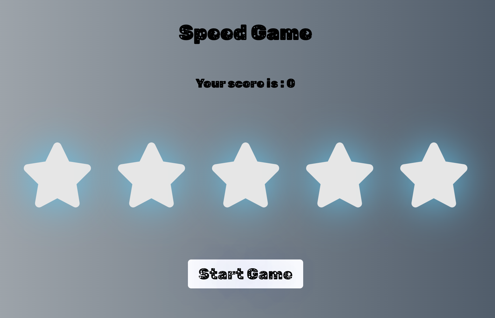

# Catch a star, make a wish!

## Speed Game with React.

### About the project

Speed game is a learninig project which was built as a part of React course with Margit Tenosaar [@margittennosaar](https://www.github.com/margittennosaar)

### Rules

- You should catch starts, as fast as you can.
- The game is getting fatser.
- You can miss 3 times. 

### Technologies used

- React.

